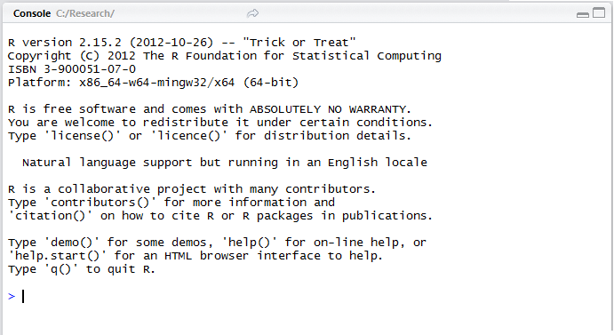
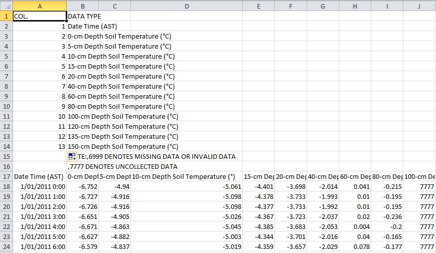
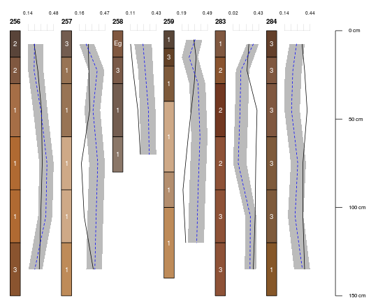
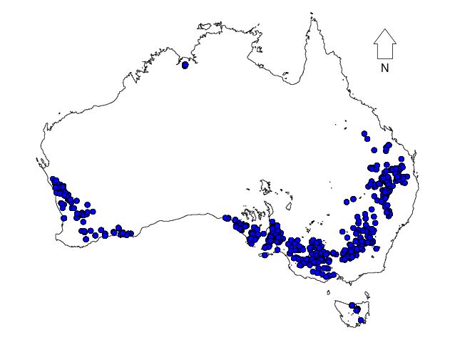
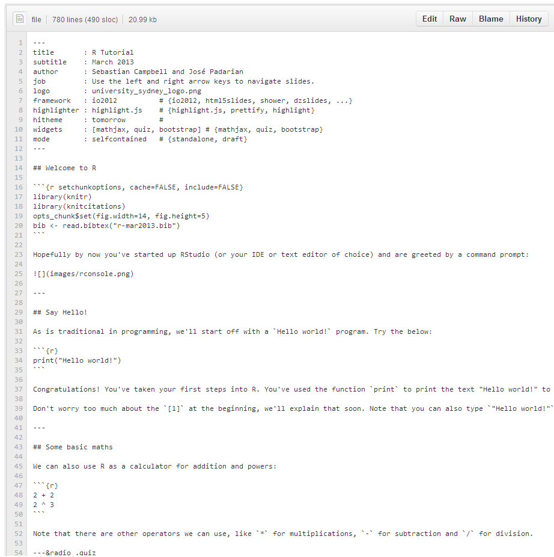

## Welcome to R

```{r setchunkoptions, cache=FALSE, include=FALSE}
library(knitr)
library(knitcitations)
opts_chunk$set(fig.width=14, fig.height=5)
bib <- read.bibtex("r-mar2013.bib")
```

Hopefully by now you've started up RStudio (or your IDE or text editor of choice) and are greeted by a command prompt:



---

## Say Hello!

As is traditional in programming, we'll start off with a `Hello world!` program. Try the below:

```{r}
print("Hello world!")
```

Congratulations! You've taken your first steps into R. You've used the function `print` to print the text "Hello world!" to the screen. Functions are basically like verbs in language, they tell R to do something. Notice the brackets `()` after the name of the function in which you can tell the function what to do.

Don't worry too much about the `[1]` at the beginning, we'll explain that soon. Note that you can also type `"Hello world!"` without the `print` command and R will assume you meant to print it.

---

## Some basic maths

We can also use R as a calculator for addition and powers:

```{r}
2 + 2
2 ^ 3
```

Note that there are other operators we can use, like `*` for multiplications, `-` for subtraction and `/` for division. 

---&radio .quiz

## Quick quiz

We'll be having a few quizzes like this during this tutorial. No pressure, it's just to check your understanding. Click 'Submit' to check if your answer is right. If you give up 'Check answer' will give you an answer. 'Clear' will allow you to start that quiz from scratch.

### What is the expected result from `6 / 2`?

1. 1
2. 2
3. _3_
4. 4

*** explanation

It's 3, because $\frac{6}{2} = 3$.

---

## Assigning variables

So now we can do some maths, but we don't want to have to remember the results every time. So let's store some as variable, so we can refer to them by name. To assign, we can use either the `=` or `<-` operator (though `<-` is recommended).

```{r}
core_volume <- 100
core_mass <- 180
bulk_density <- core_mass / core_volume

bulk_density
```

Note that assignment doesn't print the variable to the console.

---

## Not just numbers

R doesn't just work with numbers, it can also work with "strings" or characters. Strings are denoted by the quotes (`""`) surrounding them. We've already used these when we made our "Hello world!" program. In fact, we can use the `paste` function to stick them together. 

```{r}
paste("The bulk density is:", 1.75, sep=" ")
```

The `paste` function sticks strings and numbers together into a single string. The `sep` argument says: "Put a space between all of the things I'm sticking together".

---

## Making readable results

Let's combine all the things we know so far into something useful. Remember the bulk density we calculated earlier?

```{r}
paste("The bulk density is:", bulk_density, sep=" ")
```

Here R evaluated our variable `bulk_density` and added it to the string we were trying to make.

---&radio .quiz

## Quiz 2

### Which of these lines of code will produce the result: `"1:2:3:x:y:z"`

1. _paste(1, 2, 3, "x", "y", "z", sep=":")_
2. paste("123xyz", sep=":")
3. paste(1, 2, 3, x, y, z, sep=":")
4. paste(1, 2, 3, "x", "y", "z")

*** explanation

The first option. The second option won't work as there's only one string, so R can't place separators between strings. The third option is trying to call variables named `x`, `y` and `z` (but it's likely none exist). Finally, the fourth option is space-separated, not colon-separated.

---

## Bigger data

So we've been dealing with individual strings and numbers, let's move onto combining those into vectors. A vector is basically just a 1-dimensional array of data. Like a set of numbers or a shopping list. It's really easy to make vectors of sequential integers:

```{r}
1:10
5:-5
```

---

## More vectors

You can also make vectors of strings or numbers using the combine (`c`) function:

```{r}
c(5, 4, 3, 2, 8)
c("sand", "silt", "clay")
```

---

## Limits of atomic vectors

But be careful. These kinds of vectors can only take one type of data. If you combine numbers and strings together:

```{r}
c("SOILID001", 3, 5, "SOILID006", 7)
```

Then they all become characters.

If you think about it, you can treat numbers as letters, but it's a lot harder to treat letters as numbers.

---

## Even bigger data

Now that we can make vectors we can make subsets of bigger datasets, matrices and dataframes. Just to start off, we'll use a simple dataset which comes with R: `trees` (Try `?trees` for more information about the data). It is a data frame, a collection of vectors as columns. The vectors are allowed to be different types (character, integer, numeric), but they must all be the same length.

```{r}
trees
```

---

## Subsetting

The basic form of a subset is `object[whichrows, whichcolumns]`. Leaving an element blank means select all. So for example, to get the third row of `trees`, or the second column:

```{r}
trees[3, ]
trees[, 2]
```

You might have noticed the `[24]` in the second line of `trees[, 2]`. This indicates that the 72 next to it is the 24th element of that vector. There just isn't enough room on the screen to show it all in one line.

---

## Finer subsetting

We can get individual values by setting both rows and columns

```{r}
trees[3, 2]
trees[1, 1]
```

---

## The last elements

And we can also use `nrow` and `ncol` (gets the number of rows or columns) to get the last elements:

```{r}
nrow(trees)
trees[nrow(trees), ]
trees[, ncol(trees)]
```

---

## Why stop at one?

You can also subset collections of elements. To get the fourth to seventh row of the first and third column:

```{r}
trees[4:7, c(1, 3)]
```


---&radio .quiz

## Subsetting quiz

### What is the number in the third last row of the 2nd column of `trees`?

1. _80_
2. 87
3. 65
4. 10.3

***explanation

Using the line `trees[nrow(trees) - 2, 2]` will get you the third last row of the second column. Third last is the last one minus 2 places.

---

## Other ways of extracting columns

Data frames are collections of vectors, so you can use their names to extract them. You can use your original notation and also `$` notation (which is convenient, but not as powerful).

```{r}
trees[, "Height"]
trees$Height
```

---

## Subsetting by a conditional

Often, we want all the rows that meet a certain condition. Say I want all the trees where the height is greater than 82 ft. First, I can produce a TRUE/FALSE variable, then take only the cases where it is true:

```{r}
greater82 <- trees$Height  > 82
greater82[1:5]
trees[greater82, ]
```

---&radio .quiz

## Logical subsetting quiz

### How many trees are there with a girth less than 12.5 inches?

1. 3
2. 8
3. 0
4. _15_

***explanation

Using the code `trees[trees$Girth < 12.5, ]`, we can see that there are `r nrow(trees[trees$Girth < 12.5, ])` trees with a girth less than 12.5. Press 'p' to see the whole expected output.

***pnotes

```{r}
trees[trees$Girth < 12.5, ]
```

---

## Getting help

But how do I find out about all these functions? There are a few ways of getting help in R:

- The default help functions. Try `?print` or `help(print)`
- Other help functions: `RSiteSearch("soil")`
- StackOverflow
- The wonderful Google

At the moment, the help files will be fairly hard to get through, but they make more and more sense the more you use R. Some help files will be much simpler than others. If you find the help file impossible to get through, try testing the examples at the bottom of most help files or access them using the `examples` function.

---&radio .quiz

## Getting help quiz

### What does the `sep` argument of `read.csv` do?

 1. Separates the arguments with commas and puts them together
 2. _Determines the field separator character of a file which has been read in_
 3. Decides whether to use the Sepine Angulator algorithm
 4. If TRUE, splits files into list elements
 
*** explanation

 The `read.csv` function entry found using `?read.csv` or `help(read.csv)` says `sep` is the 'field separator character'.

---

## Dataframes

Now we're ready to deal with some real data. We have some soil temperature data `r citep(bib["UniversityofAlaskaFairbanks2011"])`. The best function to read in CSVs is `read.csv`. Let's store that object and call it `soiltempdata`. 

```{r, cache=TRUE, echo=FALSE}
url <- "https://raw.github.com/sebastian-c/r-mar2013/gh-pages/soiltempdata.csv"
if (.Platform$OS.type == 'unix') {
  download.file(url,'soiltempdata2.csv','curl')
  soiltempdata <- read.csv('soiltempdata2.csv')
} else soiltempdata <- read.csv(url)
```

```{r, cache=TRUE, eval=FALSE}
url <- "https://raw.github.com/sebastian-c/r-mar2013/gh-pages/soiltempdata.csv"
soiltempdata <- read.csv(url)
```


That looks like it went through nicely. No errors, no complaints.

---

## Checking your data

It's a good idea to look at the first few rows of your data, to make sure it went through ok. We'll use `head` to get the first 4 rows of ours.

```{r}
head(soiltempdata, 4)
```

Blech. That's not what we wanted at all. Most of those columns are empty.

---

## Fixing the data

What went wrong? Let's download the data and open it up in Excel or Notepad and look at it (ideally, you should do this before trying to read it in). Click [here](https://raw.github.com/sebastian-c/r-mar2013/gh-pages/soiltempdata.csv) to link to the data (if you're feeling adventurous, try using the `download.file` function to download it. Be sure to use the `mode="wb"` option). Save it to your hard drive (put it into My Documents). Then open the CSV file.



Well there's the problem, there's all this other stuff before we get to the actual data.

---

## Getting to work

Set your working directory to where you stored the data. You can use the `getwd` function to work out what directory you're in and the `setwd` function to set the working directory. Remember to use forward slashes (`/`) as the path separator.

```{r, echo=TRUE, eval=FALSE}
getwd()
```
```
## [1] "C:/Research/"
```
```{r, echo=TRUE, eval=FALSE}
setwd("C:/Users/Sebastian/Documents")
getwd()
```
```
## [1] "C:/Users/Sebastian/Documents"
```

---&radio .quiz

## Skipping the first few lines

Ok, so we had a problem with the data before, let's see if we can read it in properly this time. So the first problem is that we have a few lines before we get to the data. We could remove these manually, but R has a neat trick to sort this problem out, the `skip` argument in `read.csv`. 

### How many lines (rows) do we have to skip?

1. 1
2. 13
3. _16_
4. 17

*** explanation

There are **16** lines we have to skip (not 17, we want to keep the headers).

---

## Reading in the data

Now after all these problems, we can finally read in the data and store it as an object. We can see it actually has columns we want.

```{r}
soiltempdata <- read.csv("soiltempdata.csv", skip=16)
head(soiltempdata, 3)
```

---

## Structure of objects

Another way of examining objects is the `str` function.

```{r}
str(soiltempdata)
```

---

## Yet another problem

Something still isn't right. Look at the 100cm depth soil temperature from the previous slide. Note that you can use the `$` symbol to subset out individual columns.

```{r}
str(soiltempdata$Depth.100.cm)
```

There is no way that there is a soil with a temperature of 7777 degrees celsius. So why is that present? Well, if we reopen the data in Excel or Notepad, we'll see there were two important lines: 

- NOTE:,6999 DENOTES MISSING DATA OR INVALID DATA
- ,7777 DENOTES UNCOLLECTED DATA 

So it would seem that anything with these values should be a missing value. Turns out R has a trick for that too. Let's reread in the data again (last time, I promise).

---

## na.strings

If we look at the help file for `read.csv` (`?read.csv`), we see there's an argument called `na.strings`. We have two things we need to be NA, so we combine them like we did a few slides ago: `c(6999, 7777)`.

```{r}
soiltempdata <- read.csv("soiltempdata.csv", skip=16, na.strings=c(6999, 7777))
str(soiltempdata$Depth.100.cm)
```

And now it's full of NAs (missing values), as it should be.

---

## Summaries

A summary of a dataframe's columns can easily be obtained with `summary`:

```{r}
summary(soiltempdata)
```

---

## Histogram

A simple exploratory analysis could start, for example, with a histogram of the data to observe the distribution of the data. Try using the function `hist` with the temperatures at depth 0:

```{r}
hist(soiltempdata$Depth.0.cm)
```

(Pretty skewed, huh?)

---

## Plotting

We can now do some basic plotting. Let's look at the 0cm depth over time. This is easy using the `plot` function. We need specify the x variable and the y variable. We'll use the `type="l"` argument to make it a line plot (the default has points):

```{r}
plot(soiltempdata$ID, soiltempdata$Depth.0.cm, type="l")
```

---

## Plotting a subset
What if we have a special interest in temperature midday temperatures? Let's create a histogram of midday temperatures at depth 0:

```{r}
hist(soiltempdata$Depth.0.cm[soiltempdata$Hour == 12])
```

---

## Boxplots

Another simple and useful plot is the boxplot. Again, using the soil temperature at depth 0 and the function `boxplot`. Note that we can fix up those messy axis labels with the `xlab` and `ylab` arguments:

```{r}
boxplot(Depth.0.cm~Month,data=soiltempdata,xlab='Month',ylab='Temperature')
```


---

## Tidy data

At the moment the dataset is usable, but is it tidy `r citep(bib["Wickham2011"])`? To be tidy, a dataset must have the following qualities:

1. Each variable forms a column
2. Each observation forms a row
3. Each table stores data about one class of experimental unit

This data has multiple columns for temperature variables. It would be easier to deal with if all temperatures were in the same column. Ideally, we would have a column for date, a column for depth and a column for temperature. This is often called converted from 'wide' format (many columns, few rows) to 'long' format (few columns, many rows).

---

## Loading in packages

One of the best ways to rearrange your data is to use the `reshape2` package `r citep(bib["Wickham2007"])`. You can use the `library` or the `require` function to load it.

You may get an error:

```{r, eval=FALSE}
library(reshape2)
```
```
## Error: there is no package called 'reshape2'
```

If this happens to you, then `reshape2` has not yet been installed. Use `install.packages("reshape2")` to install it and `library(reshape2)` to load it.

---

## Reshaping data

Now we have the `reshape2` package loaded in, we can use the `melt` function to melt out dataframe. See the `?melt.data.frame` page for details. The `id.vars` are the variables we don't want to melt. The `.name` arguments control the column names of the result:

```{r}
library(reshape2)
soiltemp_melt <- melt(soiltempdata, id.vars=c("ID", "Year", "Month", "Day", "Hour"), variable.name="Depth", value.name="Temperature")

head(soiltemp_melt)
```

---

## Poor depths

See now we have depth in one column and temperature in another. That's not really good enough though. Out Depth column is still not useful. Using the `table` function to get a summary of the values in it:

```{r}
table(soiltemp_melt$Depth)
```

There are 6552 of each Depth measurement. But the depth measurement isn't a number, it's a character with a number in it. What if we could get that number out and use this column as a numeric (like Temperature is)?

---

## Regex

We can use regular expressions to extract the numbers. First, we'll use the `regexpr` function to extract the locations of the numbers:

```{r}
num_matches <- regexpr("[[:digit:]]+", soiltemp_melt$Depth)
str(num_matches)
```

The string `[[:digit:]]+` is a special string. `[[:digit:]]` means any number from 0-9 and the `+` on the end means 1 or more. So find one or more numbers. The results mean that the match starts at the 7th digit ("Depth.**0**") and is only 1 character long. If we were to scroll down to the "Depth.**150**.cm", we'd see that the match also starts at the 7th digit and is 3 characters long.

---

## From Regex to reality

We can use the `regmatches` command to convert from these positions to the actual numbers they match, then assign that back to our Depth column.

```{r}
depth_nums <- regmatches(soiltemp_melt$Depth, num_matches)
head(depth_nums)
```
Hmm... characters (you can tell by the quotes). We had better convert those to numbers before we replace our depth column).

```{r}
soiltemp_melt$Depth <- as.numeric(depth_nums)
```

---&radio .quiz

## Stop and check quiz

### What is the 3rd element of the Depth column now?

1. -6.727
2. _0_
3. 1
4. Depth.0.cm

*** explanation
It's 0 because we just converted the depths to numbers. If your data seems weird, check with one of us.

---

## Plots again

Now that we have stacked data, it's much easier to make plots. For example, it's easy to make a simple scatterplot of Temperature vs Depth.

```{r}
plot(Temperature~Depth, data=soiltemp_melt)
```

---

## Depth boxplots

We can also make better boxplots:

```{r}
boxplot(Temperature~Depth, data=soiltemp_melt, xlab="Depth", ylab="Temperature")
```

---

## plyr

Stacking out data has also made our data easier to summarise. We're going to use the `plyr` package. In particular, a function called `ddply` Let's start with something simple. Let's get the mean temperature for each Depth:

```{r}
library(plyr)
depth_mean <- ddply(soiltemp_melt, c("Depth"), summarise, meandepth=mean(Temperature, na.rm=TRUE))
depth_mean
```

---

## Plotting summaries

We can now plot that easily:

```{r}
plot(meandepth~Depth, data=depth_mean)
```

---

## More complex summaries

What if we want more? Say we want to know the temperature distribution during the day for each depth?

```{r}
depthday_dist <- ddply(soiltemp_melt, c("Hour", "Depth"), summarise, meandepthday=mean(Temperature))
head(depthday_dist, 2)
```

That summary is long and hard to plot on a simple graph. How can we make a graph that will plot something like that?

---

## ggplot2

`ggplot2` is a package which allows you to build up complex plots from basic elements `r citep(bib["Wickham2009"])`. First we define the data of the plot in `ggplot`, then define the geoms.

```{r, fig.height=4}
library(ggplot2)
ggplot(depthday_dist, aes(x=Hour, y=meandepthday)) +
  geom_point()
```

---

## Adding a little bit of colour

But how do we tell the points apart? Maybe we could give them different colours and connect the dots by lines? We'll convert Depth to factor so it isn't treated like a number (see what happens if you don't convert it to factor).

```{r}
ggplot(depthday_dist, aes(x=Hour, y=meandepthday, colour=as.factor(Depth))) +
  geom_line() +
  labs(colour="Depth")
```

---

## ggplot2

We can go back to our original melted data and look at all the depths over time if we facet by Depth.

```{r, fig.height=5}
ggplot(soiltemp_melt, aes(x=ID, y=Temperature)) +
  geom_line() +
  facet_wrap(~ Depth, ncol=3)
```

---

## Linear models

If we want to check the relation between, for example, the temperature at depth 0 and depth 5, we can use the function `lm`

```{r}
temp0 <- soiltemp_melt$Temperature[soiltemp_melt$Depth == 0]
temp5 <- soiltemp_melt$Temperature[soiltemp_melt$Depth == 5]
```

```{r}
linear_model <- lm(temp0~temp5) ## temp0 and temp5 stored as subsets
```

---

## Getting things out of a linear model

We can access some important information using `summary`:
```{r}
summary(linear_model)
```
Or using `$` in combination with `summary`:
```{r}
summary(linear_model)$r.squared
```

---

## SS tables

We can produce familiar tables containing sum of squares and pvalues using the `anova` function:

```{r}
anova(linear_model)
```

---

## Linear models: Plot

Let's plot the previous data and fitted linear model:

```{r}
plot(temp5, temp0)
abline(linear_model,col='blue',lwd=2)
```

---


## Fun to look forward to:

When you have a bit more R experience, you can make graphs like the following:

* Dates
* RGoogleVis (done)
* This presentation
* Soil graphs (from different data)
* Map with points in R

---

## googleVis

We can make your first plot a lot fancier if we want (hover your mouse over it):

```{r, results='asis', cache=TRUE, echo=FALSE}
suppressPackageStartupMessages(library(googleVis))

gvistempdata <- transform(soiltempdata, Time=strptime(paste0(Year, "-", Month, "-", Day, " ", sprintf("%02i", Hour), ":00:00"), tz="America/Anchorage", format="%Y-%m-%d %H:%M:%S"))

names(gvistempdata)[grep("Depth.0.cm", names(gvistempdata), fixed=TRUE)] <- "Temperature"

M <- gvisLineChart(gvistempdata, xvar="Time", yvar="Temperature", options=list(width=1000, height=500, lineWidth=0.5, vAxis="{title:'Temperature'}", hAxis="{title:'Time'}", legend="none", title="Alaskan surface soil temperature"))

print(M, "chart")
```

---

## Soil profiles

Plot soil profiles with the help of package `aqp`:



---

## Georeferenced data

Plot soil profiles locations:



---

## This presentation!

This presentation was entirely made in R using some useful packages such as [slidify](http://slidify.org) `r citep(bib["Vaidyanathan2012"])`. You can look at the source for it on [GitHub](https://github.com/sebastian-c/r-mar2013).



---

## Now your turn

* Here is a new [data set](https://raw.github.com/sebastian-c/r-mar2013/gh-pages/training_dataset.csv)
 * NRCS data of soil around Indonesia
* Things to try:
 * Read in the data
 * Make some basic graphs
 * Do some basic regression
 * Ask questions!
 * Make mistakes!

---

## Bibliography

```{r bibliography, echo=FALSE, results='asis'}
bibliography("html")
```
